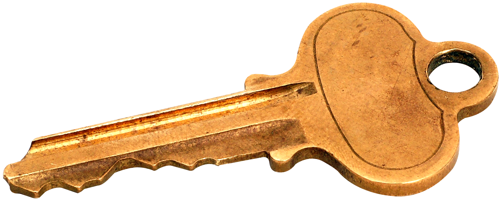

#### Chapter 6

**F6.0**
```html
<!DOCTYPE html>
<html>
<head>
<title>Page Title</title>
</head>
<body>

</body>
</html>
```

**F6.1**
```html
<!DOCTYPE html>
<html lang="en">
<head>
    <!--    Organization Name-->
    <title>Amaka & Co</title> <!--The title of the website that shows in the browser-->
    <style>
        * {
            margin: 0;
            padding: 0;
            border: 0;
        }

        section {
            width: 100%;
            height: 400px;
            float: left;
        }
    </style>
</head>
<body>
<header style="width: 100%; float: left; height: 400px; background-color: #fbb55c;">
    <!--Tint for header-->
    <div id="header-tint">
        <nav class="container" style="width: 100%; float: left; height: 70px; background-color: rebeccapurple;">
            <!--Website navigation links-->
        </nav>
    </div>
</header>
<main>
    <!--The section each section of the website
    Represents the various rows or section of the website
    -->
    <section id="top-section" style="background-color: deepskyblue;">
    </section>
    <section id="mid-section" style="background-color: darkkhaki;">
    </section>
    <section id="lower-section" style="background-color: lavender;">
    </section>
    <section id="bottom-section" style="background-color: darksalmon;">
    </section>
</main>
<footer>

</footer>
</body>
</html>
```


**F6.2**
```html
<main>
    <!--The section each section of the website
    Represents the various rows or section of the website
    -->
    <section id="top-section" style="background-color: deepskyblue;">
    </section>
    <section id="mid-section" style="background-color: darkkhaki;">
    </section>
    <section id="lower-section" style="background-color: lavender;">
    </section>
    <section id="bottom-section" style="background-color: darksalmon;">
    </section>
</main>
```


**F6.3**
```html
<ul class="unstyled-list">
    <li><a href="#"><h4>Home</h4></a></li>
    <li><a href="#"><h4>What We Do</h4></a></li>
    <li><a href="#"><h4>Team</h4></a></li>
 </ul>
```


**F6.4**
```html
<div id="header-tint">
    <nav class="container" style="width: 100%; float: left; height: 70px; background-color: rebeccapurple;">
        <!--Website navigation links-->
    </nav>
</div>
```


**F6.10**
```html
<!DOCTYPE html>
<html lang="en">
<head>
    <!--    Organization Name-->
    <title>Amaka & Co</title> <!--The title of the website that shows in the browser-->
    <style>
        * {
            margin: 0;
            padding: 0;
            border: 0;
        }

        section {
            width: 100%;
            height: 400px;
            padding: 20px 0;
            float: left;
        }

        .left {
            width: 50%;
            float: left;
            background-color: red;
        }

        .right {
            width: 50%;
            background-color: yellow;
            float: right;
        }

        .card{
            background-color: green;
        }
    </style>
</head>
<body>
<header style="width: 100%; float: left; height: 400px; background-color: #fbb55c;">
    <!--Tint for header-->
    <div id="header-tint">
        <nav class="container">  <!--Website navigation links-->
            <div class="left" style="padding: 25px 0;">
                <div id="logo">
                    <h4>Amaka & Co</h4>
                </div>
            </div>
            <div class="right" style="padding: 25px 0;">
                <ul class="unstyled-list">
                    <li><a href="#"><h4>Home</h4></a></li>
                    <li><a href="#"><h4>What We Do</h4></a></li>
                    <li><a href="#"><h4>Team</h4></a></li>
                </ul>
            </div>
        </nav>
        <div class="container">
            <div class="left" style="padding: 160px 0;">
                <h1>
                    Driving world class performance in banking, the financial services and
                    government.
                </h1>
            </div>
        </div>
    </div>
</header>
<main>
    <!--The section each section of the website
    Represents the various rows or section of the website
    -->
    <section id="top-section" style="background-color: deepskyblue;">
        <div class="container">
            <div class="left">
                <h1>What We Do</h1>
                <!---->
                <ul>
                    <li>
                        <p>
                            Lorem ipsum dolor sit amet, consectetur adipiscing elit, sed do eiusmod tempor incididunt ut
                            labore et dolore magna aliqua. <em>UTenim</em> ad minim veniam, quis nostrud exercitation
                            ullamco
                            laboris nisi ut aliquip exea commodo consequat.
                        </p>
                    </li>
                </ul>
            </div>
            <div class="right">
                <ul>
                    <li>
                        <p>
                            Lorem ipsum dolor sit amet, consectetur adipiscing elit, sed do eiusmod tempor incididunt ut
                            labore et dolore magna aliqua. Ut enim ad minim veniam, quis nostrud exercitation ullamco
                            laboris nisi ut aliquip ex ea commodo consequat.
                        </p>
                    </li>
                </ul>
            </div>
            <div class="cards-section">
                <!--Individual cards-->
                <div class="card">
                    <ul class="unstyled-list">
                        <li>
                            
                        </li>
                        <li>
                            <h4>Integrity</h4>
                        </li>
                        <li>
                            <p>
                                Lorem ipsum dolor sit amet, consectetur adipiscing elit, sed do eiusmod tempor
                                incididunt ut
                                labore et dolore magna aliqua
                            </p>
                        </li>
                    </ul>
                </div>
                <div class="card">
                    <ul class="unstyled-list">
                        <li>
                            
                        </li>
                        <li>
                            <h4>Integrity</h4>
                        </li>
                        <li>
                            <p>
                                Lorem ipsum dolor sit amet, consectetur adipiscing elit, sed do eiusmod tempor
                                incididunt ut
                                labore et dolore magna aliqua
                            </p>
                        </li>
                    </ul>
                </div>
                <div class="card">
                    <ul class="unstyled-list">
                        <li>
                            
                        </li>
                        <li>
                            <h4>Integrity</h4>
                        </li>
                        <li>
                            <p>
                                Lorem ipsum dolor sit amet, consectetur adipiscing elit, sed do eiusmod tempor
                                incididunt ut
                                labore et dolore magna aliqua
                            </p>
                        </li>
                    </ul>
                </div>

            </div>
        </div>
    </section>
    <section id="mid-section" style="background-color: darkkhaki;">
        <div class="container">
            <div class="left">
                <!---->
                <ul>
                    <li>
                        <h1>Our Beliefs</h1>
                    </li>
                    <li>
                        <p>
                            Lorem ipsum dolor sit amet, consectetur adipiscing elit, sed do eiusmod tempor incididunt ut
                            labore et dolore magna aliqua. Ut enim ad minim veniam, quis nostrud exercitation ullamco
                            laboris nisi ut aliquip ex ea commodo consequat.
                        </p>
                    </li>
                </ul>
            </div>
            <div class="right">
                <!--Move style property to css file-->
                
            </div>
        </div>
    </section>
    <section id="lower-section" style="background-color: lavender;">
        <div class="container">
            <h1>The Team</h1>
            <p> Driving world class performance in banking, the financial services and
                government.</p>
            <div class="cards-section">
                <div class="profile-card">
                    <ul class="unstyled-list">
                        <li>
                            
                        </li>
                        <li>
                            <h4>Mercy Chi Amaka</h4>
                        </li>
                        <li>
                            <p>
                                Lorem ipsum dolor sit amet
                            </p>
                        </li>
                    </ul>
                </div>
                <div class="profile-card">
                    <ul class="unstyled-list">
                        <li>
                            
                        </li>
                        <li>
                            <h4>Huseyin Simone</h4>
                        </li>
                        <li>
                            <p>
                                Lorem ipsum dolor sit amet
                            </p>
                        </li>
                    </ul>
                </div>
                <div class="profile-card">
                    <ul class="unstyled-list">
                        <li>
                            
                        </li>
                        <li>
                            <h4>Daniel Boafo</h4>
                        </li>
                        <li>
                            <p>
                                Lorem ipsum dolor sit amet
                            </p>
                        </li>
                    </ul>
                </div>
                <div class="profile-card">
                    <ul class="unstyled-list">
                        <li>
                            
                        </li>
                        <li>
                            <h4>Gabriel Steady</h4>
                        </li>
                        <li>
                            <p>
                                Lorem ipsum dolor sit amet,
                            </p>
                        </li>
                    </ul>
                </div>
            </div>
        </div>
    </section>
    <section id="bottom-section" style="background-color: darksalmon;">
        <div class="container">
            <div class="left">
                <h1>Contact Us</h1>
                <!---->
                <ul class="unstyled-list">
                    <li>
                        <p>
                            Lorem ipsum dolor sit amet, consectetur adipiscing elit, sed do eiusmod tempor incididunt ut
                            labore et dolore magna aliqua
                        </p>
                    </li>
                    <li>
                        <p>
                            Dwenninmmen
                            602 Emard Ports Apt. 280
                            Accra, Ghana
                        </p>
                    </li>
                    <li>
                        <p>
                            Email:
                            info@dwm.com.gh
                        </p>
                    </li>
                    <li>
                        <p>
                            Phone:
                            029-905-0571
                        </p>
                    </li>
                </ul>
            </div>
            <div class="right">
                <form>
                    <ul class="unstyled-list">
                        <li>
                            <input type="text" placeholder="Full name" name="firstname"><br>
                        </li>
                        <li>
                            <input type="email" placeholder="Email" name="emails">
                        </li>
                        <li>
                            <textarea placeholder="Your message"></textarea>
                        </li>
                        <li>
                            <button><h3>Submit</h3></button>
                        </li>
                    </ul>
                </form>
            </div>
        </div>
    </section>
</main>
<footer>
    <div id="map">
    </div>
    <div class="container">
        <div class="left">
            <ul class="unstyled-list">
                <li>
                    <h4>Amako & Co</h4>
                </li>
                <li>
                    <p>
                        Lorem ipsum dolor sit amet, consectetur adipiscing elit, sed do eiusmod tempor incididunt ut
                        labore et dolore magna aliqua
                    </p>
                </li>
            </ul>
        </div>
        <div class="right">
            <h5>Social Media</h5>
            <ul class="list-inline">
                <li>Facebook</li>
                <li>Twitter</li>
                <li>LinkedIn</li>
            </ul>
        </div>
    </div>
</footer>
</body>
</html>
```
